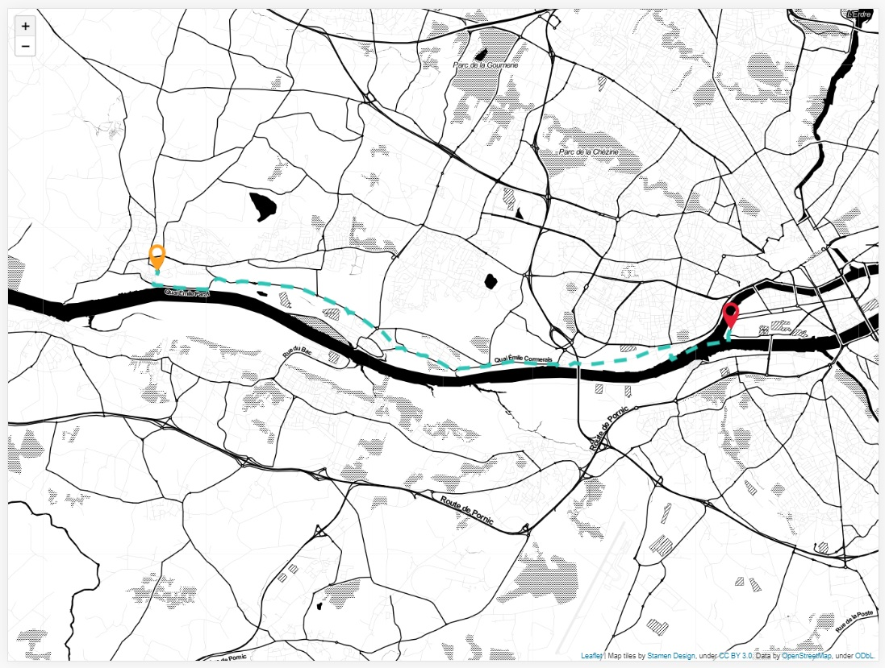

# Map path experimentation

## Description

Simple side project using Leaflet to draw a GPX trace on a map.



## Usage

To start the project, run the following script from the root of your project's directory

```
npm install
npm start
```

## Credits and references

- **Project** generated by [HTML5Boilerplate](https://html5boilerplate.com/)
- **Map** powered by [Leaflet](https://leafletjs.com/) and embellished by [Stamen Maps](http://maps.stamen.com/#watercolor/12/37.7706/-122.3782)
- **GPX** drew on map thanks to [GPX Plugin for Leaflet](https://github.com/mpetazzoni/leaflet-gpx)
